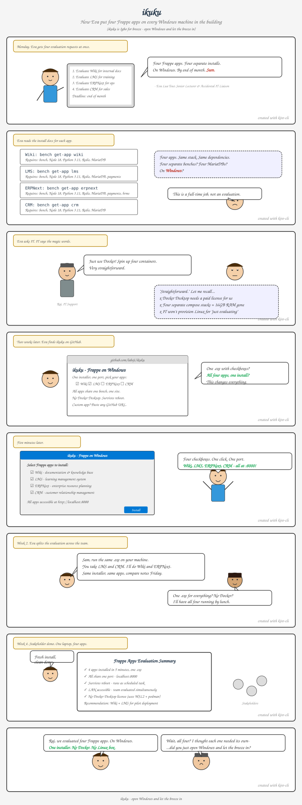

# ikuku 🌬️

Frappe apps on Windows — a better experience than Linux.

> *ikuku* (Igbo: breeze) — open Windows and let the breeze in.

One installer, one port, pick your apps. No Docker Desktop, no Linux VM, no manual setup.

## Quick Start

1. Download `ikuku-lite.exe` from [Releases](../../releases)
2. Run the installer — check the apps you want:

   ☑ Wiki · ☐ LMS · ☐ ERPNext · ☐ CRM

3. Open `http://localhost:8000`
4. Login: `Administrator` / `admin`

All selected apps share one bench, one port, one site.

## Apps

| App | Route | What it does |
|-----|-------|-------------|
| Wiki | `/wiki/` | Documentation & knowledge base with approval workflows |
| LMS | `/lms` | Learning management system |
| ERPNext | `/app` | Enterprise resource planning |
| CRM | `/crm` | Customer relationship management |

## How it works

```
┌─────────────────────────────────────────┐
│  Windows 10/11 or Server 2022           │
│  ┌─────────────────────────────────┐    │
│  │  WSL2 Ubuntu + Podman           │    │
│  │  ┌───────────────────────┐      │    │
│  │  │  Frappe Bench (:8000) │      │    │
│  │  │  Wiki · LMS · ERPNext │      │    │
│  │  │  MariaDB · Redis      │      │    │
│  │  └───────────────────────┘      │    │
│  └─────────────────────────────────┘    │
│  Scheduled task (auto-start on boot)    │
│  Port proxy: LAN:8000 → WSL:8000       │
└─────────────────────────────────────────┘
```

## For power users

```powershell
# Install with specific apps
powershell -File install.ps1 -Apps "wiki,lms"

# Manage
powershell -File start.ps1
powershell -File stop.ps1
powershell -File uninstall.ps1
```

## Requirements

- Windows 10 (build 19041+), Windows 11, or Windows Server 2022
- Hardware virtualization enabled (for WSL2)
- 16 GB RAM recommended
- Admin rights for install

## Community

ikuku is a distribution channel for Frappe apps, not a fork. We depend on and contribute to the [Frappe ecosystem](https://github.com/frappe).

## The Eva Story



## Privacy Policy

This program will not transfer any information to other networked systems unless specifically requested by the user or the person installing or operating it.

The bundled Frappe applications connect to the Frappe update server to check for updates. See the [Frappe privacy policy](https://frappecloud.com/privacy) for details.

## Code Signing Policy

Free code signing provided by [SignPath.io](https://about.signpath.io), certificate by [SignPath Foundation](https://signpath.org).

- Committers and reviewers: [labsji](https://github.com/labsji)
- Approvers: [labsji](https://github.com/labsji)

## License

[MIT](LICENSE)

## Credits

Co-created with [Kiro](https://kiro.dev) — from architecture decisions to NSIS wizards to CI pipelines, every line was pair-programmed in `kiro-cli`.
